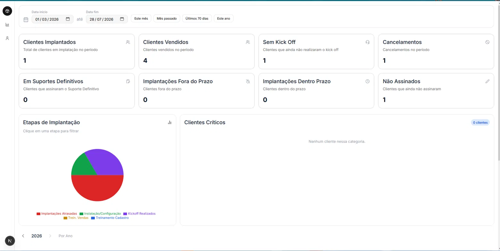

# Dashboard de Implantação

<p align="center">
  
</p>

Dashboard desenvolvido em **Next.js**, **TypeScript** e **PostgreSQL** para gerenciamento do fluxo de implantação de clientes, com KPIs, relatórios e acompanhamento em tempo real.

---

# Documentação das Rotas de API

Todas as rotas estão em `app/api/` e seguem o padrão do Next.js App Router.
O filtro de revendas é aplicado automaticamente em todas elas via `lib/domain/revendas.ts`.

---

## ⚠️ Pré-requisito: criar a VIEW no banco antes de rodar a aplicação

A aplicação **não lê diretamente da tabela `cliente`**. Ela lê de uma VIEW chamada
`implantacao_ativa`, que já filtra apenas as revendas autorizadas.

**Execute o script abaixo no pgAdmin antes de qualquer outra coisa:**

```sql
CREATE OR REPLACE VIEW implantacao_ativa AS
SELECT *
FROM cliente
WHERE revendanome IN (
  'SISTEMA ATHOS SJC',
  'SISTEMA ATHOS PINDA',
  'SISTEMA ATHOS SP',
  'THM SOLUÇÕES TECNOLOGICAS',
  'SISTEMA ATHOS JACAREÍ',
  'SISTEMA ATHOS GUARULHOS',
  'ATHOS COTIA'
);
```

Para conferir se a view foi criada corretamente:

```sql
SELECT COUNT(*), revendanome
FROM implantacao_ativa
GROUP BY revendanome
ORDER BY revendanome;
```

> Se precisar adicionar ou remover uma revenda no futuro, altere
> este script SQL **e** o arquivo `lib/domain/revendas.ts` juntos.

---

## GET `/api/kpis`

Retorna os KPIs do dashboard para um período específico.

**Parâmetros:**
| Param  | Tipo       | Obrigatório | Exemplo    |
|--------|------------|-------------|------------|
| inicio | YYYY-MM-DD | ✅           | 2026-05-01 |
| fim    | YYYY-MM-DD | ✅           | 2026-05-31 |

**Lógica:**
- `PERIODO` — clientes cadastrados entre `inicio` e `fim` das revendas autorizadas
- `ATRASADO` — clientes de períodos anteriores que ainda não têm suporte definitivo
- `NAO_ASSINADO` — clientes cadastrados sem `dataassinaturacontrato`

**Resposta:**
```json
{
  "kpis": {
    "vendidos": 28,
    "nao_assinado": 3,
    "em_implantacao": 18,
    "implantados": 12,
    "dentro_prazo": 8,
    "fora_prazo": 4,
    "suporte_definitivo": 7,
    "sem_kickoff": 2,
    "atrasados_anteriores": 5,
    "cancelados": 1
  },
  "clientes": [...]
}
```

---

## GET `/api/etapas`

Retorna a contagem de clientes por etapa do funil. Alimenta o gráfico de pizza.

**Parâmetros:** `inicio`, `fim` (mesmos do `/api/kpis`)

**Lógica:**
- Cada etapa é mutuamente exclusiva (cliente aparece só na mais avançada)
- Inclui clientes do período + anteriores ainda em aberto

**Resposta:**
```json
[
  { "etapa": "Kickoff Realizados",      "value": 4 },
  { "etapa": "Instalação/Configuração", "value": 3 },
  { "etapa": "Treinamento Cadastro",    "value": 5 },
  { "etapa": "Trein. Vendas",           "value": 2 },
  { "etapa": "Implantações Atrasadas",  "value": 6 }
]
```

---

## GET `/api/clientes-viewer`

Retorna a lista de clientes de um grupo específico.
Usado quando o usuário clica em um KPI ou em uma fatia do gráfico.

**Parâmetros:**
| Param  | Tipo   | Obrigatório  | Descrição                         |
|--------|--------|--------------|-----------------------------------|
| filtro | string | ✅            | Chave do KPI ou nome da etapa     |
| inicio | string | ✅ (só KPIs) | Não obrigatório para etapas pizza |
| fim    | string | ✅ (só KPIs) | Não obrigatório para etapas pizza |

**Filtros de KPI aceitos:**
`vendidos` · `implantados` · `sem_kickoff` · `cancelados` · `suporte_definitivo` · `fora_prazo` · `dentro_prazo` · `nao_assinado`

**Filtros de etapa (pizza) aceitos:**
`Kickoff Realizados` · `Instalação/Configuração` · `Treinamento Cadastro` · `Trein. Vendas` · `Implantações Atrasadas`

**Resposta:**
```json
{
  "clientes": [
    {
      "codigo": "1234",
      "nome": "Mercado São Jorge",
      "dias": 35,
      "etapaAtual": "Treinamento Cadastro",
      "assinatura": "2026-05-01",
      "kickoff": "2026-05-03",
      "instalacao": "2026-05-10",
      "cadastro": "2026-05-17",
      "vendas": null,
      "supDef": null
    }
  ]
}
```

---

## GET `/api/clientes-pagina`

Retorna todos os clientes para a página de listagem completa.
Sem filtro de período — traz o panorama atual do ano.

**Parâmetros:** nenhum

**Inclui:**
- Clientes cadastrados no ano corrente (todas as revendas autorizadas)
- Clientes de anos anteriores que ainda não têm suporte definitivo

**Resposta:**
```json
{
  "clientes": [
    {
      "codigo": "1234",
      "nome": "Mercado São Jorge",
      "cnpj": "11111111000101",
      "endereco": "Av. Brasil, 100, Centro, SJC, SP",
      "telefone": "(12) 99999-1111",
      "dataCad": "2026-05-01",
      "dataAss": "2026-05-02",
      "kickoff": "2026-05-03",
      "dataInst": "2026-05-10",
      "etapaAtual": "Treinamento Cadastro",
      "status": "Ativo",
      "diasImplantacao": 35,
      "dentroDoProazo": "DENTRO"
    }
  ]
}
```

---

## GET `/api/cliente-historico`

Retorna o histórico de acompanhamento semanal de um cliente específico.
Os dados vêm da tabela `descricao_historico`, vinculada à ocorrência de "Processo de Implantação".

**Parâmetros:**
| Param     | Tipo   | Obrigatório |
|-----------|--------|-------------|
| idcliente | number | ✅           |

**Como funciona:**
1. Busca na tabela `ocorrencia` um registro com `descricao ILIKE '%Processo de Implantação%'`
2. Busca todos os registros de `descricao_historico` vinculados a essa ocorrência
3. Classifica cada registro pelo prefixo do texto:
   - `"Observações kick-off/Primeiro contato:"` → kickoff
   - `"Semana N:"` → semana N
   - `"Observações Gerais:"` → observações gerais
   - `"Implantação Finalizada:"` ou `solucao = true` → finalizada

**Resposta:**
```json
{
  "kickoff": {
    "data": "2026-05-03",
    "observacao": "Kick-off realizado com sucesso, equipe presente."
  },
  "semanas": {
    "1": { "data": "2026-05-10", "observacao": "Instalação concluída." },
    "2": { "data": "2026-05-17", "observacao": "Treinamento de cadastro iniciado." }
  },
  "observacoesGerais": {
    "data": "2026-05-20",
    "observacao": "Cliente engajado, sem pendências."
  },
  "implantacaoFinalizada": true
}
```

---

## GET `/api/relatorio-anual`

Retorna os dados mês a mês do ano informado para a tabela estilo planilha.

**Parâmetros:**
| Param | Tipo   | Obrigatório | Exemplo |
|-------|--------|-------------|---------|
| ano   | number | ✅           | 2026    |

**Resposta:**
```json
{
  "linhas": [
    {
      "mes": 1, "label": "JAN",
      "qtdVendas": 18, "qtdSemEtapa": 0, "qtdCancelados": 0,
      "kickoff": 0, "instalacao": 0, "tCadastro": 0, "tVendas": 0,
      "supDefinitivo": 18, "totalImplantacoes": 18, "deficit": 0
    }
  ],
  "totais": {
    "qtdVendas": 100, "supDefinitivo": 60, "deficit": 5
  }
}
```

---

## GET `/api/kpis-anuais`

Retorna os 4 KPIs do card lateral da seção anual.

**Parâmetros:** `ano` (number)

**Resposta:**
```json
{
  "vendidos": 100,
  "implantados": 95,
  "pctImplantados": 95,
  "defasagem": 5
}
```

---

## Estrutura de arquivos relevante

```
lib/
├── db.ts                    ← conexão com o banco
├── domain/
│   ├── revendas.ts          ← lista de revendas + gerador de placeholders
│   ├── cliente.ts           ← regras: etapa, prazo, status, endereço, telefone
│   ├── labels.ts            ← textos de exibição (etapa, status, prazo)
│   └── historico.ts         ← parser do texto de acompanhamento semanal
└── queries/
    ├── clientes.ts          ← SELECTs de clientes (dados brutos)
    └── ocorrencias.ts       ← SELECTs de ocorrência e histórico
```

---

# 📸 Preview da Aplicação

Dashboard desenvolvido para acompanhamento do processo de implantação de clientes, permitindo visualizar indicadores em tempo real, etapas da implantação, clientes críticos e relatórios anuais.

<p align="center">
  
</p>

### Funcionalidades demonstradas

- 📊 Dashboard com KPIs de implantação
- 📈 Gráfico das etapas de implantação
- 👥 Visualização de clientes críticos
- 🔍 Filtros por período
- 📅 Relatório anual de desempenho
- ⚡ Atualização dos dados via API do Next.js

<p align="center">
  <a href="https://SEU-LINK-AQUI.com">
    <strong>🚀 Acessar Demonstração</strong>
  </a>
</p>